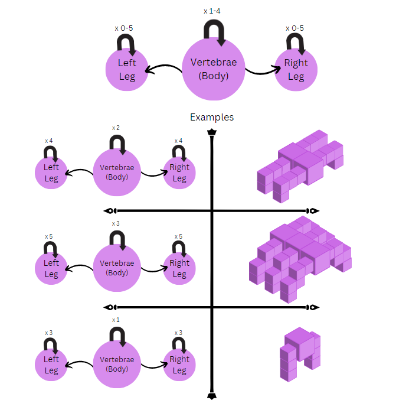
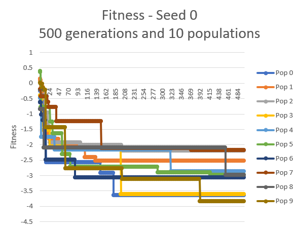

# ME495 Artificial Life Final Project Winter 2023

## Evolving Locomotion
## Author: Vaishnavi Dornadula
## Last Editted: March 14th, 2023

### Relevant Files to Run the Final Project (Changed from Ludobots Final Project)
1. pyrosim -> material_normal.py: contains rgb and opacity values to change the visual appearance of the normal (non sensor) blocks
2. pyrosim -> material_sensor.py: contains rgb and opacity values to change the visual appearance of the sensor blocks
3. body.urdf: the description file for the robot body
4. brain.nndf: neural network description file containing the motor and sensor neurons
5. world.sdf: contains the world elements
6. constants.py: contains variables used across multiple files that remain unchanged 
7. motor.py: class that sets motor joint values
8. robot.py: handles the sensing and movement of a robot as well as evaluating its fitness
9. sensor.py: gets sensor values and saves them in data files
10. simulate.py: interfaces with simulation functions
11. simulation.py: runs the simulation in direct or gui mode
12. world.py: loads the world file 
13. search.py: the main file generates a parallel hill climber class object and evaluates it for the number of generations/populations specified in constants.py

### Required installations to run code
- python3
- pybullet
- wheel (Optional for Windows Users)

### How to run the code
- This assignment is hosted on the 'finalproject_assgnt9' branch of this repo.
- There are multiple ways to clone this project:
    1. To get the clone key, click on the green 'code' button in the upper right side of the repo. Then copy the html or ssh key given under the 'local' tab depending on your security preferences
    2. 'git clone ssh-or-html-key' will clone the whole repo and will automatically start in the main branch. To switch branches, use git switch or git checkout to move to the finalproject_assgnt9 branch
    3. alternatively to step 2, 'git clone -b my-branch git@github.com:user/myproject.git' will clone a particular branch of the repo, where in this case, 'my-branch' should be 'finalproject_assgnt9' and 'git@github.com:user/myproject.git' should be the clone key you obtained in step 1

- Once the repo is cloned, run 'python .\search.py'. Depending on your system and python installations, your 'python' may be 'python3' or 'py'.
- To run a specific ID, leave only lines 6-8 commented out. The parameter passed into the Show_Specific() function is the ID of the robot you would like to run. To run evolution, only have line 10 commented. solution.py's constructer sets the seed on line 18 which can be changed to control the random factor of the initial parent robot. 

### What was Fixed/Changed from Assignment 8
In assignment 8, I was able to generate random 'snakes' in three dimensions which would move properly in the -x direction as they were evolved. I had a bug where the back leg of the last vertebrae would not appear correctly but that is fixed in this final project. I would also hit an issue where the program would not be able to access a fitness file or could not find a brain file but this was solved using a try except method in a for loop so that the program waited until it could access the necessary files. I also was not able to run evolution on this assignment past a population and generation size of 15 each but following the professor's suggestion, I limited the number of joints and decreased the time between each simulation step. This allowed my computer to then run 10 populations for 500 generations which took anywhere between an hour and 3 hours depending on the number of joints the randomly generated initial parent had. In assignment 8, I had the body fixed to 4 'vertebrae' and 5 links in each leg. The randomness came from the direction the legs branched out from the body, which is further explained in the section below about how the robot bodies are generated. In this final project, I allowed the vertebrae of the initial parent to be a random number between 1 and 4, the legs to be between 0 and 5 links long, and the direction of the leg links to grow in random directions. The mutation of changing a dimension of the leg links remained the same in this final project.

### Number of Simulations that were Run
As per the assignment guidelines, I ran 10 different random seeds, each with a population size of 10 and 500 generations. These random seeds affected how many vertebrae and the number and direction of leg links on the robot body. I ran random seeds, 0-10 except for seed 2 because it created a robot body that would not be able to evolve. The videos and fitness plots shown below the evolution of these robots over 500 generations in 10 populations.

### How the Robots are Created and Evolved
Below is the explaination for how random snakes were generated in 3 dimensions. For this assignment, we took these 3d snakes and evolved them. The fitness function I chose was to see how to move the snake further in the negative x direction. The way my robot is generated remains in the same loop format as described below and there are a few ways the initially generated parents are different based on the random seed used. The 'vertebrae' of the snake is set to 1-4 links long and each link has a pair of legs that are 0-5 links long. Both these values are randomly generated in the constructor so are the same between parents and children. These links are set up to be in a random direction. For example, a random direction array or [0,1,0,0,1] means that the legs will be outward, downward, out, out, and down. Each of its children will have this same leg set up but the mutation function allows the dimensions of the leg blocks to change. 

So the children are similar to the parent in the number of vertebrae links, and number and directions of the leg links. The sensor selection for each cube occurs in the Create_Body() function so this is different in the children generated. The mutation function chooses a dimension at random (x,y,z) and changes that dimension for the leg block to be a random number that's within the size limit of the vertebrae cube. These are two ways the children differ from the parent. The brain is generated from the sensor links that are specified and the motors. The synapses are generated between all the elements with a random weight. 

I used the parallel hill climber method for selection where a child is generated and is a copy of the parent. This child is mutated and the body and brain are generated based on that mutation. Since I am running a population of 10, 10 children are created in this way based on each parent and then evaluated. The fitness of the children are then compared to its parent. Since we want our robot to move in the negative x direction, we check the parent child pair and save whichever one has the lower value in its fitness. Then at the end of 500 generations, we compare the 10 remaining robots (1 from each population) to see which performed the best. In some generations, the child will replace the parent if the mutation was beneficial and in some, the parent will prevail.

How random snakes were created in 3D: The solution class constructor creates a random number between 1 and 4 (inclusive) to determine the number of links the snake's vertebrae will contain. The code has similar logic to assignment 6 in which we generate a single dimention snake that extends in the x direction. The description for how that single chain snake is created is in the README in the assignment_6 branch. In the Generate_Body() function, I set up a number of nested for loops that I incrementaly coded. First, I started with one vertebrae and added legs to one side in the y direction. I constrain the legs the randomly choose to be outwards or downwards and generate a random number of them between 0 and 5. This allows the spine block to have legs in the x and z directions. The for loop that generates these random legs from a given spine block uses the directions determined randomly in the constructor, then creates the joint at the correct position, accounting for if the previous block was outwards or downwards. These leg blocks are also constrained to be within the size of its related spine block to avoid self collisions with other blocks. Each leg block is placed relative to the previous but since the first leg block is connected to the root, its coordinates were absolute. This for loop is then repeated to generate a new leg on the other side of the spine block. The number of links in each leg is determined randomly in the constructor. Once this was working with the motor neurons and randomly generated sensor neurons in a similar fashion as assignment 6, I had a robot with a single center body and random legs being generated in the x and z directions. Next I encapsulated that nested for loop into another to generate more vertebrae with legs, allowing the snake to grow in the y direction as well. This for loop created a new vertebrae block and made the random legs for either side for how many ever random links were created in the solution class constructor. The second link to the spine was specified in absolute coordinates since it was connected to the root but all others were relative to the vertebrae before. Each set of legs was linked to its vertebrae so that it would hopefully be able to move like a weird centipede. This meant there were a lot more variables to track from assignment 6 which is why the for loops are much longer.

### Observations about Evolved Creatures
I was really excited to clearly see evolution occur over the 500 generations. The fitness plots are shown a few sections below and the videos of the robots are at the end of this README, but I observed that the robots went from not moving at all or struggling to move to developing a gait of some sort or using fast vibrating legs to propel itself in the -x direction. A trend I observed was that every evolved robot was larger in atleast one dimension than its random starting parent. Since there was a cap to how large the legs got however, some populations stumbled upon a faster gait much quicker and then plateaued. Since the sensor placement, synapse weights, and leg block dimensions could change in each generation, I wonder how my results would look different if I set two of those to be constant with the parent. It was interesting to see the wide variety of robots that emerged from running different seeds. The robots either grew taller to develop a gait or wider and stuck closer to the ground to bound or vibrate to move. Seed 4 did the best, as seen in the fitness plots below and the next best two were 1 and 3. All three of these robots had more of its legs in the downward direction and developed a gait over generations. I would want to run more seeds before conclusively stating this but it is an interesting trend that the gait based robots(taller) consistently performed better than the longer robots did.

### How to Run the Best Robots of Each Seed
The body and brain files of the best robot from each seed is stored in the 'Best_Bot_Files' folder of the repo. This folder contains subfolders specifying the seed and the files within it are named with the ID that had the best fitness over the full run. The function in ParallelHillClimber.py, Play_Specific(), takes in a parameter for the ID of the brain and body that you want to run. For example, if you would like to run the best robot from the 5th seed, first navigate to the 'Best_Bot_Files' folder and then the 'seed5' folder. Since the ID of the robot that did best in this seed is 4631, the files are named 'body4631' and 'brain4631'. Copy these two folders and paste them in the root folder of the repo where search.py and solution.py are located. In the main file, 'search.py', make sure that lines 6-8 are commented out to ensure that the files you just coppied aren't deleted or overwritten. Pass the number 4631 into the Play_Specific function call on line 10 and run 'python .\search' to see that robot on the simulation. 

### Fitness Curves
The plots shown below show the fitness curves of 10 different runs, each with a different random seed specified in the solution.py file's constructor. The best fitness in each generation is saved into a file called 'fitness_seed#.csv' where the number is the random seed that was set. The x axis shows the generation number and the y shows the fitness. Since I was trying to get the robot to move further in the negative x direction, the downward curve of the graphs shows how the fitness gets better in each generation. Each line shows how a population did over the 500 generations.

### Videos
In this final project, we generated bodies in three dimensions with a variable number of vertebrae links of a set size and a variable number of leg links which are grown in random directions. The mutation will change the size of 1 dimension chosen at random to a new random number within a bound. Then we assign sensors to random links as well and I assigned all joints to also have a motor. Line 137 of the solution.py file specifies that the joint type created for the motors will always be the 0th index of the joint_list variable. Changing the 0 to the commented line that's on the same line will randomize the type of joint generated between those two cubes. I changed this to 0 because it was difficult to tell if my robot was exibiting strange behavior or if there was a prismatic joint, but users are welcome to change that back. It was interesting to see the different ways the robot evolved, some grew much longer and quickly shimmied its way forward and some grew taller and 'walked'. The random and evolved robots are highlighted in the gif below and a longer explaination with extra videos of other robots that emerged are shown in the second video. 

The 10 second sped up gif is at:  

The longer explaination video can be found at: 

#### This project is based on the Ludobots course on Reddit
#### Assigned by Dr. Kriegman at Northwestern University
